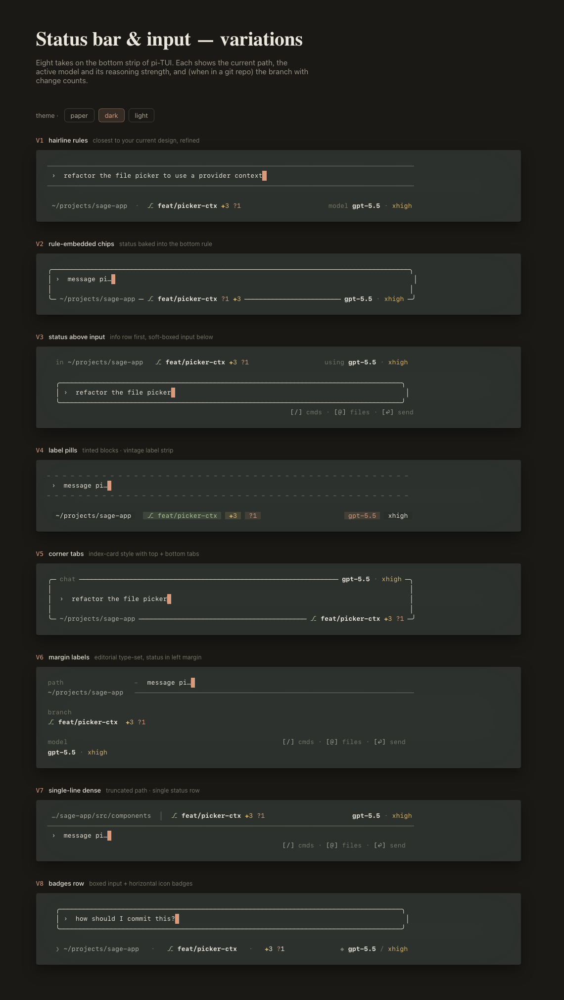
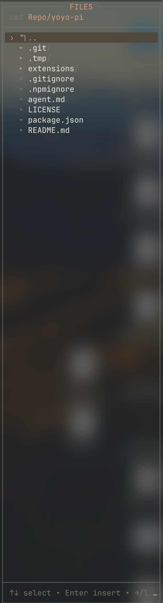
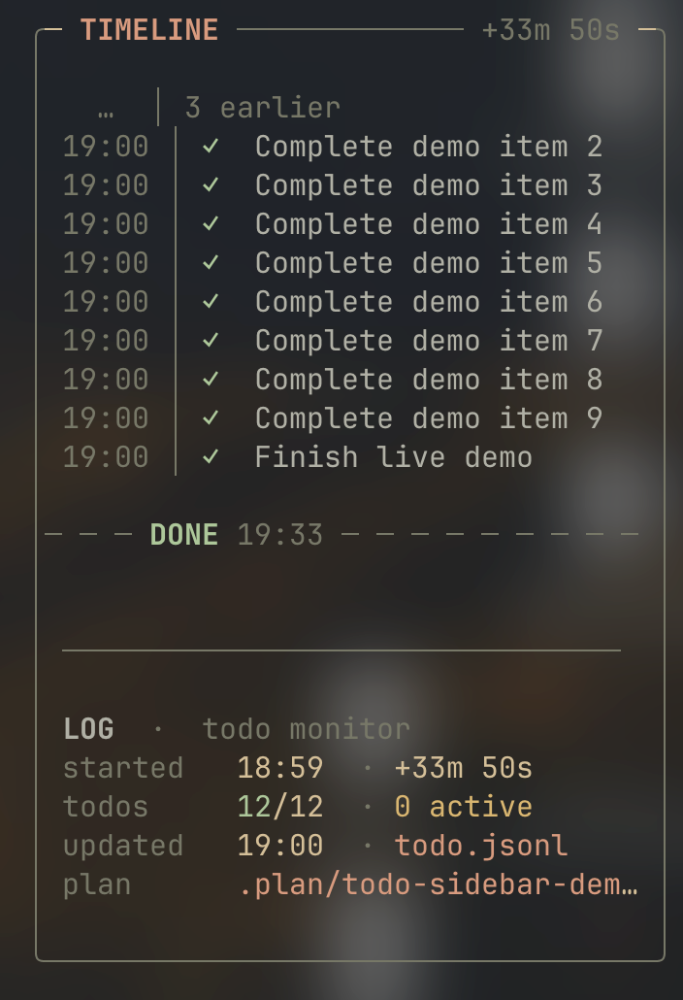
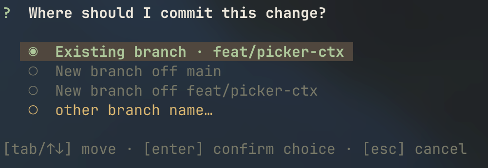
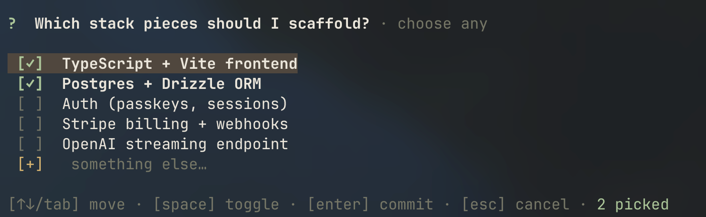

# yoyo-pi

<p align="right">
  <a href="README.md"></a>
  <a href="README.zh-CN.md"></a>
</p>

一个为 [pi](https://pi.dev) 打磨的扩展包，让终端里的 coding-agent 工作流更快、更清爽，也更顺手。

这是 Kenx 日常使用的 pi 配置，并封装成可复用的 GitHub 安装包：Vim 风格提示词编辑、自定义 TUI 主题和状态栏、右侧文件/待办覆盖层、交互式选择器、上下文快照，以及只读规划模式。

## 亮点

- **Vim 提示词编辑** — 使用 `/vim` 切换普通/插入/可视风格的提示词控制，包含状态提示和外部编辑器兜底。
- **自定义 TUI 外观** — 通过 `/theme`、`/theme-bg` 和 `/switch-statusbar` 切换主题、全屏背景覆盖，以及 8 种状态栏/输入框布局。
- **文件树 / 待办覆盖层** — 使用 `/filetree` 或 `Ctrl+Shift+F` 打开右侧文件选择器；使用 `/todo` 或 `Ctrl+Shift+T` 监控 `.plan/*.jsonl` 待办。
- **对 Agent 友好的选择器** — `single_choice`、`multiple_choice` 和 `choice_questions` 让模型可以用结构化方式向用户确认决策。
- **上下文快照** — `/clear` 保存当前分支上下文，然后用 `/restore <name>` 在之后恢复。
- **规划模式** — `/plan` 提供沙盒化的 `plan_agent`，用于在 `.plan/` 下编写实现计划和待办。

## 预览

### 状态栏与输入框变化



交互式 HTML 预览：[打开状态栏 playground](https://htmlpreview.github.io/?https://github.com/kenxcomp/yoyo-pi/blob/main/docs/previews/pi-tui-status-bar.html?v=9d4f442)。

### 文件树覆盖层



### Todo 时间线侧边栏



### 选择器





## 安装

```bash
pi install git:git@github.com:kenxcomp/yoyo-pi.git
```

不安装的临时测试方式：

```bash
pi -e git:git@github.com:kenxcomp/yoyo-pi.git
```

未固定版本的 Git URL 会在你运行 `pi update` 时跟随 `main`。只有在需要可复现版本时才固定 tag，例如 `git:git@github.com:kenxcomp/yoyo-pi.git@v0.1.3`。

安装本包后，请删除或移走 `~/.pi/agent/extensions/` 下旧的本地副本，避免重复注册 slash commands。

## 命令与工具

| 区域 | 命令 / 工具 | 提供能力 |
| --- | --- | --- |
| 上下文快照 | `/clear`, `/restore <name>` | 将当前分支上下文保存到 `.tmp/<name>.jsonl`，之后可恢复。 |
| Vim 提示词模式 | `/vim [on\|off\|status]` | 类 Vim 的模态提示词编辑器，带外部编辑器兜底。 |
| 选择器 | `single_choice`, `multiple_choice`, `choice_questions`, `/choice-demo [multi\|questions]` | 行内胶囊单选、紧凑多选，以及分 tab 的批量问题。 |
| TUI 基础设施 | `/theme <paper\|light\|dark>`, `/theme-bg <true\|false>`, `/filetree`, `Ctrl+Shift+F`, `/switch-statusbar <1-8\|0>` | 主题、可选全 TUI 背景填充、右侧文件选择覆盖层，以及自定义状态栏/输入框 UI。运行时偏好存储在 `~/.pi/agent/state/kenx-infra.json`。 |
| 规划 / Todo 工作流 | `/plan`, `/todo <goal>`, `/todo [show\|off\|status]`, `Ctrl+Shift+T`, `plan_agent` | 只读规划模式会委托 `agents/plan-agent.md` 进行规划；todo 模式会在右侧时间线侧边栏写入/监控 `.plan/todo.jsonl`，并要求 agent 在执行过程中持续更新状态。 |

## 开发

本包有意将 Pi 核心包列为可选 `peerDependencies`，因为 Pi 会在运行时提供它们。

`pi.extensions` manifest 会显式列出入口，因此 `extensions/plan-mode/sandbox.ts` 不会被当作普通扩展自动加载；它只会由子级 plan-agent 进程加载。
